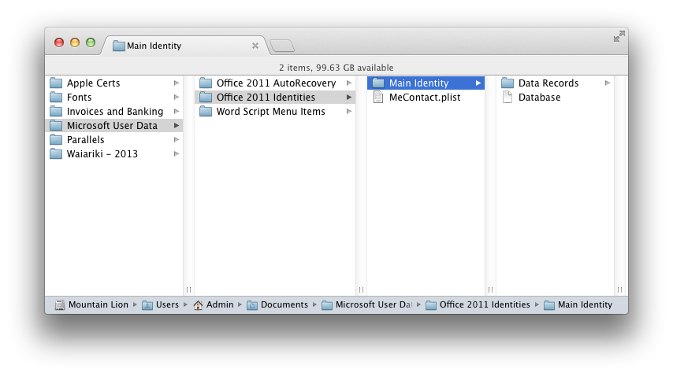
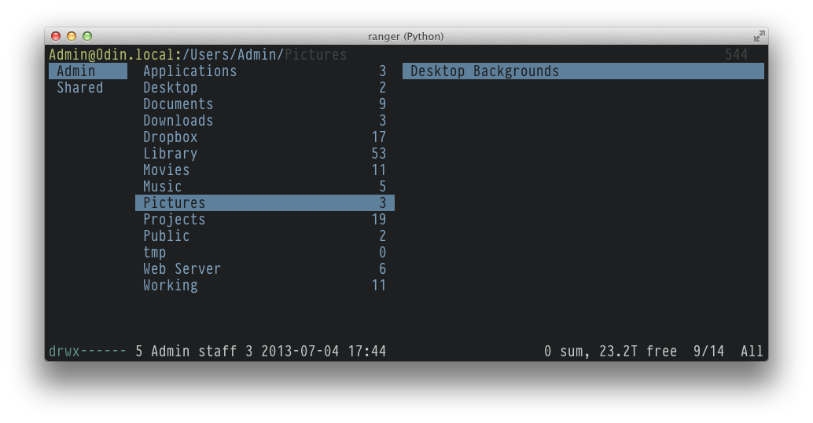

Ranger
======

_A column browser for JavaScript objects_

Basically this but for browsers:



It's similar to the terminal app of the same name.



## Technical Details

    <pane:model> {
      title: 'First Pane'
      key: 'a'
      contents: <item:collection> [
        <item:model> {
          title: '1'
        }
        <item:model> {
          title: '2'
          child: <pane:model> {
            title: 'Second Pane'
            key: 'b'
            contents: <item:collection> [
              <item:model> {
                title: 'b - 1'
              }
            ]
          }
        }
      ]
    }

# Documentation

## Ranger

```html
<body>
    <div class="browser">
    </div>
</body>
```

```javascript
var ranger = new Ranger({
    el: $('.browser');
});
```

# Copyright & License

TODO: Paste in MIT license

# Changelog

## 0.2.1

- Clean up code
- Use browserify instead of coffee-scrunch
- Start writing some proper documentation
- Add a license
