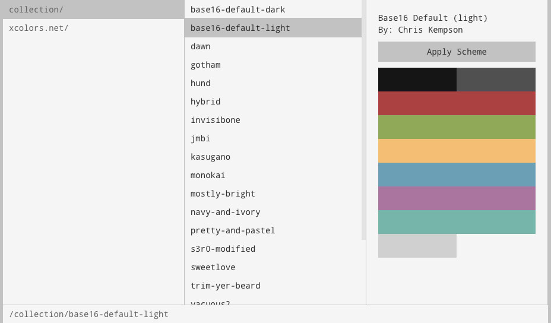

# Ranger

> a column browser for javascript objects

Uses React.



## Usage

```javascript
var React = require('react');
var Ranger = React.createFactory(require('ranger'));

var files = Ranger.parseList([
    'code/test.txt',
    'code/makefile',
    'readme.md',
]);

var store = Ranger.createStore(files, function (item) {
  console.log('opening', item);
});

React.render(Ranger({store: store}, document.body);
```
